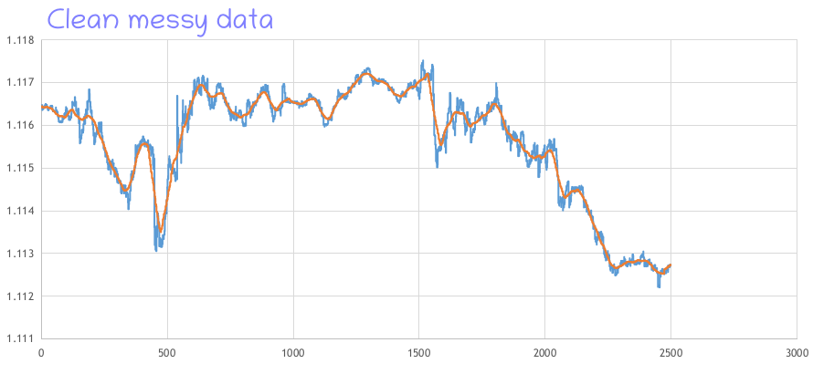
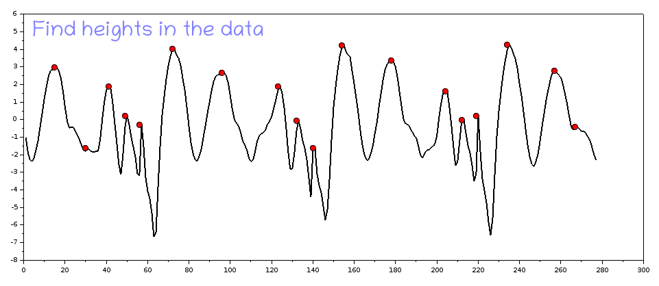
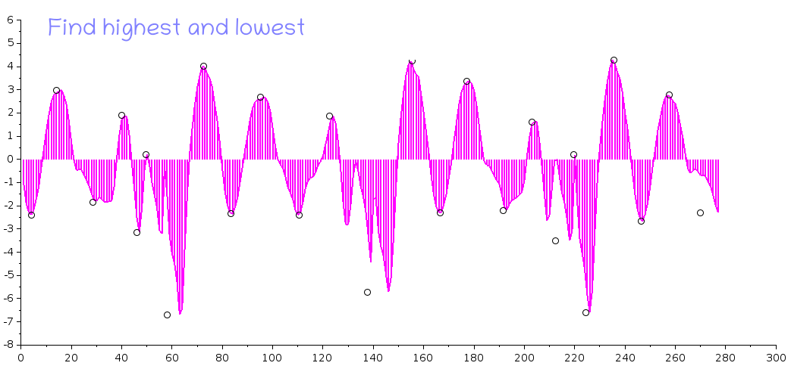
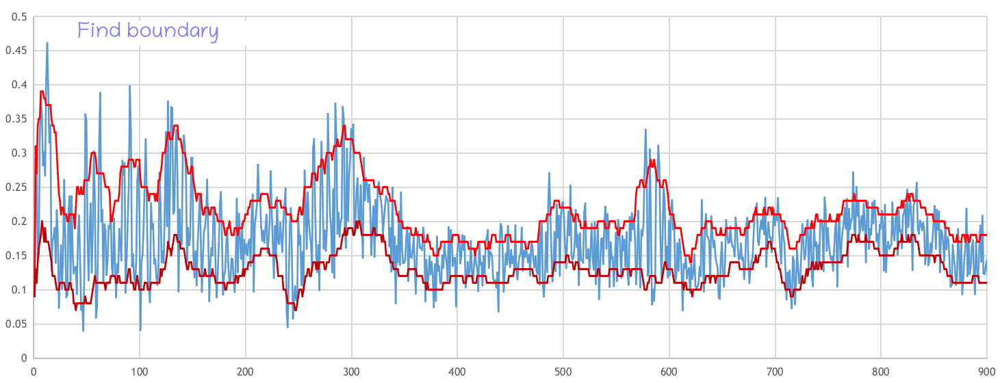
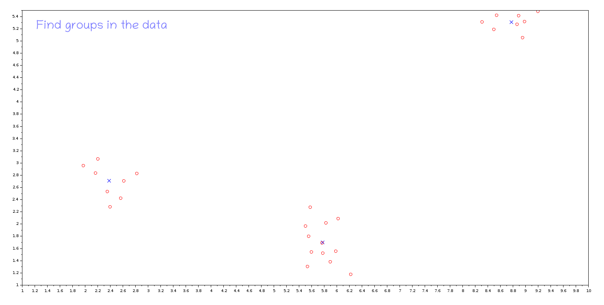
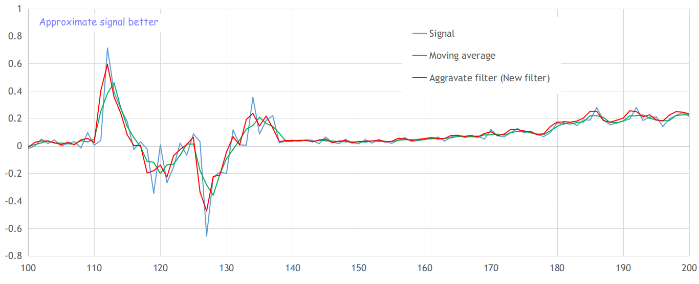

# Shuddo - A clean data processing and analysing library

I was hoping to make an efficient and smart numerical data processing library in Python for Engineers. Hopefully, I would create and add more and more functions for everyone to benefit from. I made everything from scratch based on my fundamental knowledge and observations in numerical data. This library is written using built-in Python functions so no external libraries are needed. See some examples below :)

To use, just include shuddo directory into your project.

*For usages and applications restrictions please refer to LICENSE.txt*

Cheers!

Md Imam Hossain (emamhd@gmail.com)
